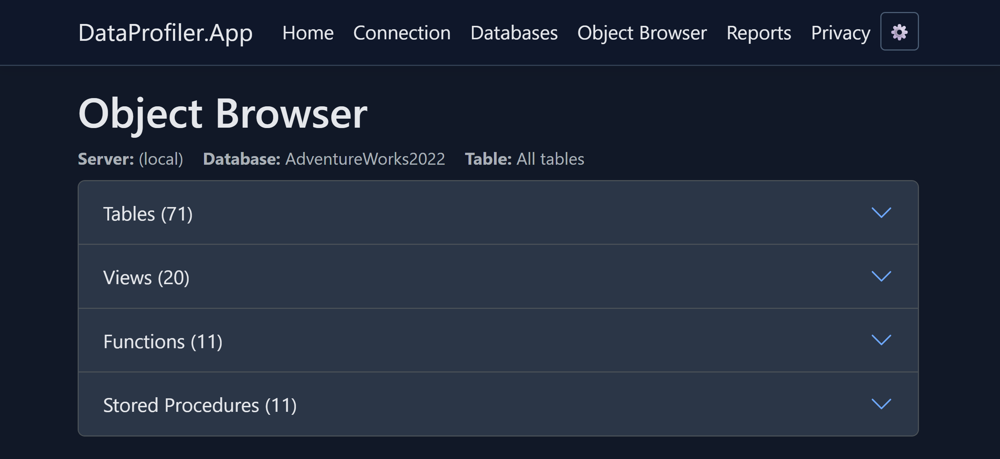
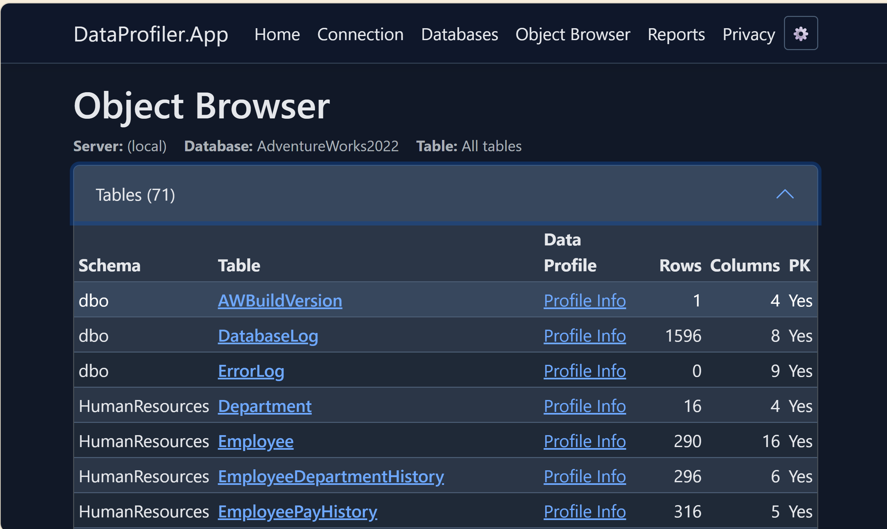

# DataProfiler

A web-based SQL Server database exploration and profiling tool that helps database administrators, developers, and analysts quickly understand database structure, generate schema scripts, and analyze data quality.

## Overview

DataProfiler provides a streamlined workflow for exploring SQL Server databases without writing queries. The application offers three core capabilities:

- **Schema Discovery** - Browse database objects, tables, columns, and relationships
- **Script Generation** - Export `CREATE TABLE` scripts and schema definitions
- **Data Profiling** - Analyze column statistics, data quality, and value distributions

## Key Features

- 🔍 **Interactive Schema Browser** - Navigate database objects with a clean, intuitive interface
- 📊 **Automated Data Profiling** - Statistical analysis including nulls, distinct counts, min/max values, and frequency distributions
- 📝 **Script Export** - Generate production-ready `CREATE TABLE` scripts
- 📈 **Excel Reporting** - Comprehensive table reports with hyperlinked navigation
- 🎨 **Theme Support** - Light, dark, and ocean color themes
- ⚡ **V3 Optimized Stored Procedure** - 30-40% faster profiling with the included `usp_ProfileTable_v3_OPTIMIZED` stored procedure

## Workflow

DataProfiler follows a simple, guided workflow:

### 1. Connect to a Server and Database

Start by connecting to your SQL Server instance and selecting a database to explore.

### 2. Object Browser Sections
Click the down-arrow to the right of the Tables, Views, Functions or Stored Procedures section to view lists of objects.

*Screenshot placeholder: Object Browser showing choice of Tables, Views, Functions or Stored Procedures*

#### 2A. Clicking on a table name opens the Column Browser


*Screenshot placeholder: Object Browser showing list of tables*

#### 2B. Clicking on the "Profile Info" link beside a table name opens the data profile for the table 
- View names and schemas


### 3. Column Browser

Select a table to view detailed column information:
- Column names and data types
- Nullability
- Default values
- Identity columns
- Computed columns
- Extended column descriptions

From here you can:
- Generate `CREATE TABLE` scripts
- Navigate to data profiling


*Screenshot placeholder: Column Browser showing table columns*

### 4. Data Profiling

Analyze actual data in the selected table:
- **Count Statistics** - Total rows, null counts, distinct values
- **Numeric Analysis** - Min, average, max, standard deviation
- **Text Analysis** - Min/max/average length
- **Date Analysis** - Earliest and latest dates
- **Value Frequency** - Most common values with counts and percentages
- **ID Column Detection** - Automatic handling of identifier columns


*Screenshot placeholder: Data Profiling page showing column statistics*

### 5. Excel Report Generation

Generate comprehensive Excel workbooks containing:
- **Summary Sheet** - Database overview with hyperlinked table navigation
- **Detail Sheets** - Per-table analysis with full profiling results
- **Hyperlinked Navigation** - Jump between summary and detail sheets
- **Professional Formatting** - Styled headers, banded rows, and freeze panes

**Report Confirmation Page:**


*Screenshot placeholder: Reports confirmation page showing selected tables*

**Sample Excel Report:**


*Screenshot placeholder: Excel report showing summary and detail sheets*

## Technology Stack

- **Framework**: ASP.NET Core Razor Pages (.NET 10)
- **Database**: SQL Server 2016 or later
- **UI**: Bootstrap 5 with custom theming
- **Excel Generation**: Open XML SDK
- **Background Processing**: Hosted service with in-memory queue

## Getting Started

### Prerequisites

- .NET 10 SDK
- SQL Server 2016 or later
- Windows, Linux, or macOS

### Installation

1. Clone the repository:
   ```bash
   git clone https://github.com/yourusername/DataProfiler-VS.git
   cd DataProfiler-VS
   ```

2. Deploy the V3 stored procedure to your target database(s):
   ```sql
   -- Run the script from DataProfiler.App/Docs/usp_ProfileTable_v3_OPTIMIZED.sql
   -- This provides significantly better performance than dynamic SQL profiling
   ```

3. Configure connection settings in `appsettings.json` (optional - can also connect via UI):
   ```json
   {
	 "TableProfiling": {
	   "DefaultSampleSize": 1000000,
	   "DefaultTimeout": 300
	 }
   }
   ```

4. Run the application:
   ```bash
   cd DataProfiler.App
   dotnet run
   ```

5. Navigate to `https://localhost:5001` in your browser

### Configuration

#### Table Profiling Options

Configure profiling behavior in `appsettings.json`:

```json
{
  "TableProfiling": {
	"DefaultSampleSize": 1000000,
	"DefaultTimeout": 300,
	"DefaultFrequentValueLimit": 10
  }
}
```

#### Connection Security

- SQL Server Authentication (username/password)
- Windows Authentication (trusted connection)
- Credentials are session-based and never persisted

## Deployment

For production deployment, see [Deployment Guide](DataProfiler.App/Docs/DEPLOYMENT_GUIDE.md) for:
- IIS configuration
- Application pool settings
- Timeout configuration for long-running reports

## Documentation

Additional documentation is available in the `DataProfiler.App/Docs/` folder:

- [Deployment Guide](DataProfiler.App/Docs/DEPLOYMENT_GUIDE.md) - Production deployment settings
- [Schema and Profile Design](DataProfiler.App/Docs/SCHEMA_AND_PROFILE_DESIGN.md) - Architecture documentation
- [Field Reference](DataProfiler.App/Docs/FIELD_REFERENCE.md) - Complete field catalog
- [V3 Implementation Notes](DataProfiler.App/Docs/V3_IMPLEMENTATION_COMPLETE.md) - Performance optimization details

## Architecture

- **Presentation Layer**: Razor Pages with server-side rendering
- **Service Layer**: 
  - `SchemaDiscoveryService` - Database metadata discovery
  - `TableProfilingService` - Data analysis and statistics
  - `TableReportService` - Excel report generation
- **Background Processing**: Report queue with progress tracking
- **Session State**: Connection context and user selections

## Performance

The V3 stored procedure (`usp_ProfileTable_v3_OPTIMIZED`) provides:
- **30-40% faster** profiling compared to dynamic SQL
- Efficient varchar tracking with configurable sample sizes
- Optimized frequent value detection
- Reduced memory overhead

## Contributing

Contributions are welcome! Please feel free to submit issues or pull requests.

## License

[Your License Here]

## Support

For questions or issues, please open a GitHub issue or contact [your contact information].

---

**Built with ❤️ using ASP.NET Core and SQL Server**
